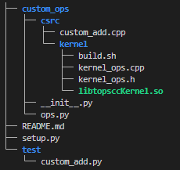
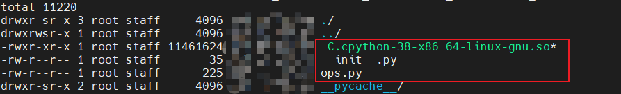

.. _custom_op:

###################################
custom op使用说明
###################################

本文主要介绍如何使用topscc编写C++的自定义算子，并集成到PyTorch中，供用户在python层调用自定义接口。

为便于解释该功能，假设有下面的示例中的工程目录结构：

要实现基于topscc的custom c++ op主要分为以下几个步骤：

1. 编写topscc kernel，并编译成so；

2. 定义一个op，并注册给gcu，同时编写op的C++实现；

3. python custom op定义；

4. setup.py文件配置——Cppextension编译选项设置；

5. 自定义module编译与安装；

6. 测试用例与执行。

=====================================
topscc kernel编写与编译
=====================================

按照topscc的编程规范与语法规则，编写完对应的topscc kernel实现之后，将对应的kernel实现编译成对应的so文件，供后续调用。

在编写完之后，得到示例中的custom_ops/csrc/kernel/目录中的cpp和h文件，

编译(示例路径： ``custom_ops/csrc/kernel/build.sh`` )：

.. code-block:: bash
    :name: custom_ops/csrc/kernel/build.sh

    /opt/tops/bin/topscc  -shared -fPIC  kernel_ops.* -o libtopsccKernel.so -ltops -ltopsrt  -L/opt/tops/lib -ltopsrt -I/opt/tops/include

编译之后会得到一个动态库：libtopsccKernel.so，供注册给PyTorch的op实现在C++中调用，本例中假设封装的topscc kernel声明为下面的函数:

声明(示例路径： ``custom_ops/csrc/kernel/kernel_ops.h`` )：

.. code-block:: C++
    :name: custom_ops/csrc/kernel/kernel_ops.h

    /**
    * @brief 这个函数用于执行两个整数数组的元素相加操作，并将结果存储在指定的输出
    *        数组中。
    *
    * @param out_ptr 指向输出数组的指针，用于存储相加的结果
    * @param lhs_ptr 指向第一个输入的指针
    * @param rhs_ptr 指向第二个输入的指针
    * @param N 数组的长度
    * @param stream 计算流对象
    */
    extern "C" void vec_add_cpp(int *out_ptr, int *lhs_ptr, int *rhs_ptr, size_t N, topsStream_t stream);

=====================================
pytorch op定义与backend注册
=====================================

1. op定义

本文中将注册给PyTorch的module设置为 ``custom_ops``，也是setup.py中所设置的cppextension name。

并定义了下面两个函数，签名如下(示例路径： ``custom_ops/csrc/custom_add.cpp``)：

.. code-block:: C++
    :name: custom_ops/csrc/custom_add.cpp

    // Registers _C as a Python extension module.
    PYBIND11_MODULE(TORCH_EXTENSION_NAME, m) {}

    TORCH_LIBRARY(custom_ops, m) {
        m.def("add_forward(Tensor lhs, Tensor rhs) -> Tensor");
    }

2. op注册

将上面定义的两个op注册给我们自己的backend，PrivateUse1就是对应的device，也就是我们的GCU backend(示例路径： ``custom_ops/csrc/custom_add.cpp`` )：

.. code-block:: C++
    :name: custom_ops/csrc/custom_add.cpp

    TORCH_LIBRARY_IMPL(custom_ops, PrivateUse1, m) {
        m.impl("add_forward", &add_forward);
    }

3. op实现及kernel调用

上面注册时， ``&add_forward`` 为绑定的自定义op的c++实现。

其中，要注意两个接口： ``getGCUTensorDataPtr`` 和 ``getCurrentGCUStream``。

``getGCUTensorDataPtr`` —— torch_gcu包装的接口，用于获取at::Tensor的device dataptr；

``getCurrentGCUStream`` —— torch_gcu包装的接口，用于获取计算使用的stream；

这两个接口的返回值通常需要根据topscc kernel的需要传递给对应的kernel实现，此处为："vec_add_cpp"。

大致实现如下(示例路径： ``custom_ops/csrc/custom_add.cpp`` )：

.. code-block:: C++
    :name: custom_ops/csrc/custom_add.cpp

    ......
    #include "kernel/kernel_ops.h"
    #include "torch_gcu.h" // torch_gcu 对外暴露相关接口的头文件

    // custom op shape infer函数，创建op的output tensor
    at::Tensor ShapeInfer(const at::Tensor& lhs, const at::Tensor& rhs) {
        at::Tensor out = at::empty(lhs.sizes().vec(), lhs.options());
        return out;
    }

    at::Tensor add_forward(const at::Tensor& lhs, const at::Tensor& rhs) {
        // 获取at::Tensor的GCU数据指针，作为kernel的inputs地址
        void* lhs_ptr = torch_gcu::getGCUTensorDataPtr(lhs_int32);
        void* rhs_ptr = torch_gcu::getGCUTensorDataPtr(rhs_int32);

        // 通过shape infer函数创建output tensor
        at::Tensor output = ShapeInfer(lhs, rhs)

        // 获取output的数据地址
        void* out_ptr = torch_gcu::getGCUTensorDataPtr(output);

        // 获取计算stream
        auto stream = torch_gcu::getCurrentGCUStream();

        // 调用topss kernel实现，实现位于libtopsccKernel.so中
        vec_add_cpp((int*)out_ptr, (int*)lhs_ptr, (int*)rhs_ptr, lhs.numel(), stream);

        return output;
    }

=====================================
python层op定义与实现
=====================================

下面定义了一个myadd的python层op接口，并通过 ``torch.ops.custom_ops`` 调用注册的 ``add_forward`` 函数完成op的计算。其中 ``custom_ops`` 就是对应注册给pytoch的module名称。

示例路径： ``custom_ops/ops.py``

.. code-block:: python
    :name: custom_ops/ops.py
    :emphasize-lines: 4

    import torch

    def myadd(a: Tensor, b: Tensor) -> Tensor:
        return torch.ops.custom_ops.add_forward(a, b)

同时在示例路径 ``custom_ops/__init__.py`` 中加载生成的 ``_C.cpython-38-x86_64-linux-gnu.so`` (后面会生成该文件)，方便将其中的custom op c++接口供外部调用：

.. code-block:: python
    :name: custom_ops/__init__.py
    :emphasize-lines: 2

    import torch
    from . import _C, ops # 加载 _C.xxx.so，并导出 ops.py 中的接口

=====================================
setup.py文件配置
=====================================

setuptools使用说明可以参考：https://setuptools.pypa.io/en/latest/userguide/ext_modules.html

示例路径： ``setup.py``

.. code-block:: python
    :name: setup.py
    :emphasize-lines: 11,38,40,42,48,54,58

    import os
    import torch
    import glob

    from setuptools import find_packages, setup

    from torch.utils.cpp_extension import (
        CppExtension,
        BuildExtension,
    )

    library_name = "custom_ops"

    def get_extensions():
        debug_mode = os.getenv("DEBUG", "0") == "1"
        if debug_mode:
            print("Compiling in debug mode")

        extension = CppExtension

        extra_link_args = []
        extra_compile_args = {
            "cxx": [
                "-O3" if not debug_mode else "-O0",
                "-fdiagnostics-color=always",
            ],
        }
        if debug_mode:
            extra_compile_args["cxx"].append("-g")
            extra_link_args.extend(["-O0", "-g"])

        this_dir = os.path.dirname(os.path.curdir)
        extensions_dir = os.path.join(this_dir, library_name, "csrc")
        sources = list(glob.glob(os.path.join(extensions_dir, "*.cpp")))

        ext_modules = [
            CppExtension(
                # 模块名称
                name=f"{library_name}._C",
                # 源文件列表
                sources=sources,
                # 头文件目录列表
                include_dirs=[
                    "custom_ops/csrc/kernel/",
                    "/opt/tops/include/",
                    "/usr/local/lib/python3.8/dist-packages/torch_gcu/include", # 以torch_gcu的实际安装目录为准
                ],
                # 依赖的库列表
                libraries=[
                    "topsccKernel",
                    "topsrt",
                    "torch_gcu",
                ],
                # 库所在的目录列表
                library_dirs=[
                    "/opt/tops/lib/",
                    "/usr/local/lib/python3.8/dist-packages/torch_gcu/lib/", # 以torch_gcu的实际安装目录为准
                ],
                runtime_library_dirs=[
                    "custom_ops/csrc/kernel/"
                ],
                extra_compile_args=extra_compile_args,
                extra_link_args=extra_link_args,
            )
        ]

        return ext_modules

    setup(
        name=library_name,
        version="0.0.1",
        packages=find_packages(),
        ext_modules=get_extensions(),
        install_requires=["torch"],
        cmdclass={"build_ext": BuildExtension},
    )

.. note::
    setup name为对应module名称 ``custom_ops``。

    本例中sources中主要包含一个cpp文件：custom_add.cpp，其中会使用所编译的topscc kernel的实现，以及torch_gcu暴露的相应接口（获取dataptr和stream），所以在编译extension时，需要指定相应的so文件；同时由于steam等接口存在于runtime接口中，也需要link对应的so文件，因此可以看到include_dirs、library_dirs、runtime_library_dirs中，分别有下面几个路径：

    1. "custom_ops/csrc/kernel/", —— topscc kernel api 头文件和生成 ``libtopsccKernel.so`` 路径；

    2. "/opt/tops/include/", —— tops runtime等相关头文件路径；

    3. "/usr/local/lib/python3.8/dist-packages/torch_gcu/include", —— torch_gcu对外暴露的获取dataptr和stream的头文件路径；

    4. "/opt/tops/lib/", —— ``libtopsrt.so`` 等动态库文件路径；

    5. "/usr/local/lib/python3.8/dist-packages/torch_gcu/lib/" —— ``libtorch_gcu.so`` 动态库文件路径

    setup.py文件中对应的libraries中包含本示例中用到的所有依赖动态库名称： ``topsccKernel`` 、 ``topsrt`` 、 ``torch_gcu`` 三个。

=====================================
自定义module编译与安装
=====================================

有两种方式编译与安装上面的自定义module，即本示例中的 ``custom_ops``:

.. code-block:: bash
    :emphasize-lines: 3,8,9

    # 方式一：
    # 编译之后立刻安装
    pip install .

    # 方式二：
    # step1. 先编译得到whl包
    # step2. 再安装dist目录中的whl包安装
    python setup.py bdist_wheel
    pip install dist/custom_ops-0.0.1-cp38-cp38-linux_x86_64.whl

=====================================
测试用例及执行
=====================================

示例路径： ``test/custom_add.py``

.. code-block:: python
    :name: test/custom_add.py
    :emphasize-lines: 4,10

    import torch
    import torch_gcu

    import custom_ops

    x = torch.tensor([1,2,3,4]).gcu()
    y = torch.tensor([1,2,3,5]).gcu()

    # 调用注册的函数
    z = custom_ops.ops.myadd(x, y)

测试运行时的流程如下：

1. topscc kernel build得到so

.. code-block:: bash

    cd custom_ops/csrc/kernel
    bash build.sh

2. 自定义module的编译和安装（两种方式均可行）

.. code-block:: bash

    pip install .

编译安装custom_ops module之后，会在： ``/usr/local/lib/python3.8/dist-packages/custom_ops`` 路径下看到下面的安装之后的module内容，因此使用时直接通过 ``import custom_ops`` 来调用其中的 ``ops.myadd`` 函数：

3. run test

.. code-block:: bash

    python test/custom_add.py

=====================================
添加反向算子
=====================================

前面介绍的是对于普通operator的注册和调用过程，对于training(autograd)场景的支持还不够完整，需要对上面的部分代码做一些调整，具体说明如下：

1. topscc kernel层变化

   如果有必要添加反向算子的kernel，同样需要根据反向算子的语义及公式编写相应的topscc kernel，对外提供对应头文件中的backward函数声明，由于本例中反向函数为常量值，无实际计算部分，所以无需对应kernel。编写完所需要的反向函数之后，同样编译得到libtopsccKernel.so即可；

2. C++层op定义及注册及实现的变化

   除了前向函数之外，还需要提供对应的反向函数的定义、注册和实现，因此需要做以下改动：

   示例路径： ``custom_ops/csrc/custom_add.cpp``

.. code-block:: C++
    :name: custom_ops/csrc/custom_add.cpp

    ......

    // 前向函数实现
    at::Tensor add_forward(const at::Tensor& lhs, const at::Tensor& rhs) {
       ......
    }

    // 反向函数实现
    std::tuple<at::Tensor, at::Tensor> add_backward(at::Tensor grad_output) {
        at::Tensor scalar_tensor = at::tensor(1.0).expand(grad_output.sizes());
        at::Tensor broadcasted_tensor = scalar_tensor.to(grad_output.device());
        return std::make_tuple(broadcasted_tensor, broadcasted_tensor);
    }

    // Registers _C as a Python extension module.
    PYBIND11_MODULE(TORCH_EXTENSION_NAME, m) {}

    TORCH_LIBRARY(custom_ops, m) {
        m.def("add_forward(Tensor lhs, Tensor rhs) -> Tensor");
        // 反向函数定义
        m.def("add_backward(Tensor grad_output) -> (Tensor grad0, Tensor grad1)");
    }

    TORCH_LIBRARY_IMPL(custom_ops, PrivateUse1, m) {
        m.impl("add_forward", &add_forward);
        // 反向函数注册
        m.impl("add_backward", &add_backward);
    }

3. python custom op定义变化

   由于需要反向实现，需要定义一个类并重载torch.autograd.Function类，完整改动如下：

   示例路径： ``custom_ops/ops.py``

.. code-block:: python
    :name: custom_ops/ops.py
    :emphasize-lines: 4,6,12,19

    import torch
    from torch import Tensor

    __all__ = ["MyAdd"]

    class MyAdd(torch.autograd.Function):
        # 前向函数
        @staticmethod
        def forward(ctx, a, b):
            ctx.save_for_backward(a, b)
            # 调用 C++ 前向实现
            return torch.ops.custom_ops.add_forward.default(a, b)

        # 反向函数
        @staticmethod
        def backward(ctx, grad_output):
            a, b = ctx.saved_tensors
            # 调用 C++ 反向实现
            return torch.ops.custom_ops.add_backward.default(grad_output)

4. setup.py 和 自定义module的编译和安装部分无需变化

5. 测试用例的变化

示例路径： ``test/custom_add.py``

.. code-block:: python
    :name: test/custom_add.py
    :emphasize-lines: 12

    import torch
    import torch_gcu

    import custom_ops

    x = torch.tensor([1.0, 2.0, 3.0, 4.0]).gcu()
    y = torch.tensor([1.0, 2.0, 3.0, 5.0]).gcu()

    x.requires_grad_(True)
    y.requires_grad_(True)

    z = custom_ops.ops.MyAdd.apply(x, y)

    z.sum().backward()

    print("x.grad: ", x.grad)
    print("y.grad: ", y.grad)

上面测试的执行过程和前面也无任何变化，至此完成整个custom op正反向的实现过程。
