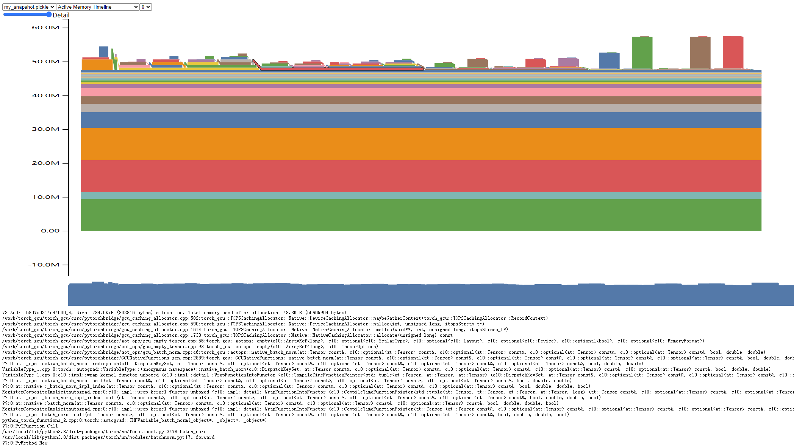
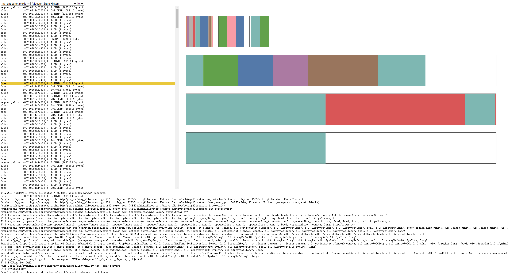

.. _memory usage:

###################################
了解GCU显存使用
###################################

官方文档参考：https://pytorch.org/docs/2.9/torch_cuda_memory.html

==================
生成GCU显存使用快照
==================

.. code-block:: python
    :linenos:
    :emphasize-lines: 11,16

    import torch
    import torchvision
    import torch_gcu

    torch.manual_seed(1 << 30)
    model = torchvision.models.resnet18(pretrained=False).gcu()
    model.eval()

    # 开启GCU显存使用记录
    torch.gcu.memory._record_memory_history()
    with torch.no_grad():
        x = torch.randn(1, 3, 224, 224).gcu()
        y = model(x).cpu()
    # 导出GCU显存使用快照
    torch.gcu.memory._dump_snapshot("my_snapshot.pickle")

==================
使用可视化工具
==================

导出的pickle文件可以通过网页可视化工具查看：https://pytorch.org/memory_viz

Active Memory Timeline

Allocator State History

