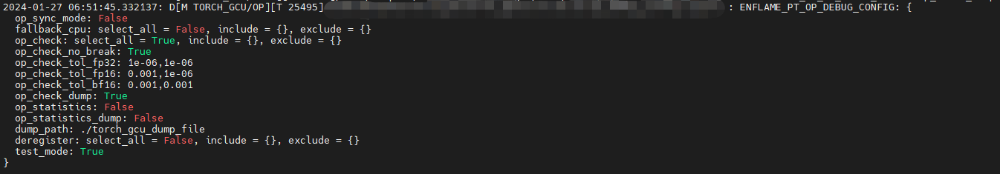
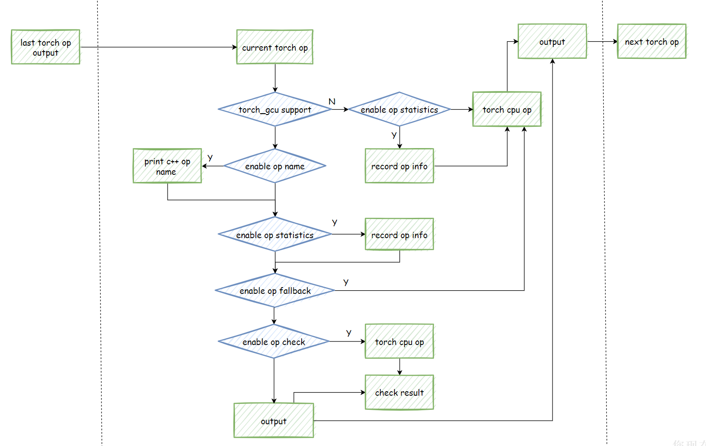
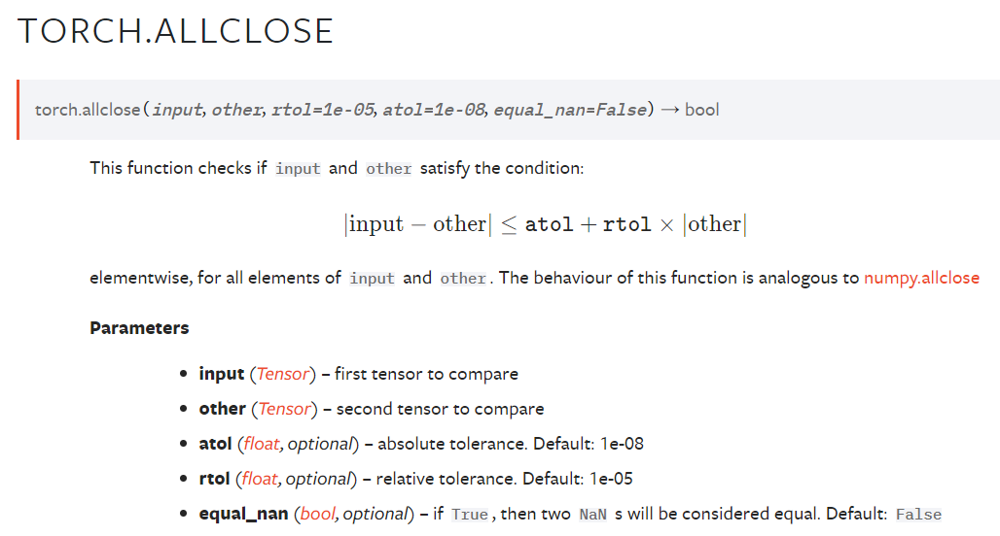
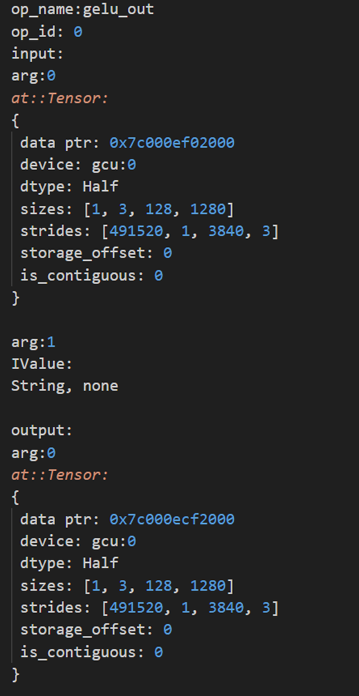
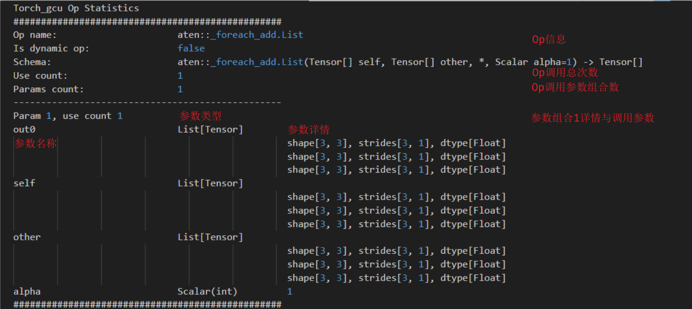
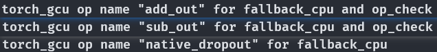
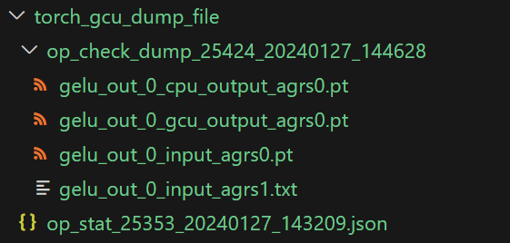
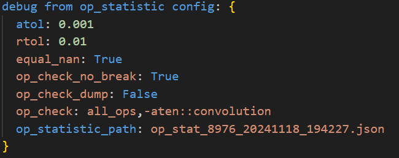

.. _op_debug:

###################################
Op Debug模块使用说明
###################################

.. contents:: 目录

==================
概述
==================

Op Debug模块用于调试eager模式中op执行相关问题，包含如下功能：

1. 同步执行

2. op fallback

3. op check

4. op statistics

5. op input/output dump

6. python call trace

7. op check from statistics

以及其他辅助模块。

1 ~ 6 项功能通过 ``ENFLAME_PT_OP_DEBUG_CONFIG`` 环境变量控制，有2种设置方式：

1. 在shell脚本中通过 ``export ENFLAME_PT_OP_DEBUG_CONFIG="xxx"`` 设置。

2. 在python文件中通过 ``import os; os.environ["ENFLAME_PT_OP_DEBUG_CONFIG"] = "xxx"`` 设置。

.. warning::
    环境变量需要在 ``import torch_gcu`` 之前设置才会生效，重复设置以最后一次设置为准。

第 7 项功能主要用于模型太大，op check 工具失效的情形，不依赖环境变量，依赖 op statistics 保存的文件。

``ENFLAME_PT_OP_DEBUG_CONFIG`` 包含如下设置选项，不同设置选项之间以 **空格** 分隔，不同选项的先后顺序没有限制：

+--------------------+--------------------------------+---------------+------------+
| 选项               | 含义                           | 类型          | 默认值     |
+====================+================================+===============+============+
| op_sync_mode       | 见 `同步执行模式`_ 节          | bool          | false      |
+--------------------+--------------------------------+---------------+------------+
| fallback_cpu       | 见 `op fallback`_ 节           | str           | ""         |
+--------------------+--------------------------------+---------------+------------+
| op_check           | 见 `op check`_ 节              | str           | ""         |
+--------------------+--------------------------------+---------------+------------+
| op_check_no_break  | 见 `op check`_ 节              | bool          | false      |
+--------------------+--------------------------------+---------------+------------+
| op_check_tol_fp32  | 见 `op check`_ 节              | double,double | 1e-6,1e-6  |
+--------------------+--------------------------------+---------------+------------+
| op_check_tol_fp16  | 见 `op check`_ 节              | double,double | 1e-3,1e-3  |
+--------------------+--------------------------------+---------------+------------+
| op_check_tol_bf16  | 见 `op check`_ 节              | double,double | 1e-3,1e-3  |
+--------------------+--------------------------------+---------------+------------+
| op_check_dump      | 见 `op check`_ 节              | bool          | false      |
+--------------------+--------------------------------+---------------+------------+
| op_statistics      | 见 `op statistics`_ 节         | bool          | false      |
+--------------------+--------------------------------+---------------+------------+
| op_statistics_dump | 见 `op statistics`_ 节         | bool          | false      |
+--------------------+--------------------------------+---------------+------------+
| op_input_dump:     | 见 `op input/output dump`_ 节  | str           | ""         |
+--------------------+--------------------------------+---------------+------------+
| op_output_dump:    | 见 `op input/output dump`_ 节  | str           | ""         |
+--------------------+--------------------------------+---------------+------------+
| dump_path          | 见 `文件保存`_ 节              | str           | ""         |
+--------------------+--------------------------------+---------------+------------+
| op_calltrace       | 见 `python call trace`_ 节     | bool          | false      |
+--------------------+--------------------------------+---------------+------------+

合法的使用方式示例：

.. code-block:: bash

    export ENFLAME_PT_OP_DEBUG_CONFIG="op_sync_mode=true fallback_cpu=all_ops,add,-add op_check=all_ops,add,-add op_check_no_break=true op_check_tol_fp32=1e-4, op_check_tol_fp16=,1e-5 op_check_dump=true op_statistics_dump=true dump_path=~/log op_calltrace=true"

在开启 ``ENFLAME_LOG_DEBUG_MOD="TORCH_GCU"`` 环境变量时，加载torch_gcu模块后会打印已设置信息，搜索 ``ENFLAME_PT_OP_DEBUG_CONFIG`` 关键字可以看到相关信息如下图所示：

通过此方式可以查看当前设置是否生效。

|

debug模块整体执行流程如图所示：

|

==================
同步执行模式
==================

示例： ``op_sync_mode=true``

torch_gcu默认使用异步执行模式，即使用异步接口进行算子下发，不等待算子执行完成就返回，并继续下发后续算子。这种方式能够使当前算子执行与后续算子下发在cpu和gcu上并行，可以提高整体性能。只有当用户显式调用同步接口（例如 ``torch.gcu.synchronize`` ）或者调用触发同步操作的行为（例如 ``tensor.cpu``、``tensor.item`` )时才会进行同步。

异步执行模式在遇到hang问题或者core dump问题时，其堆栈信息可能不准确，此时可以使用同步执行模式进行调试。即在每个op下发后都进行同步，等待当前op在gcu上执行完成后再继续下发op。

==================
op fallback
==================

op fallback模块使用torch cpu op替换gcu op，主要用于gcu op支持不完善需要用torch cpu算子替代，或者排查gcu op问题的场景。目前只支持计算类op，view类op不支持fallback。

torch_gcu尚未对接的op会自动fallback到torch cpu，如果fallback失败请与torch_gcu团队联系处理。

相关设置
----------

fallback_cpu
"""""""""""""""

示例： ``fallback_cpu=all_ops,op_name,-op_name``

不同op之间以逗号分隔。 ``all_ops`` 表示将所有支持fallback的op都进行fallback， ``op_name`` 表示将指定op fallback， ``-op_name`` 表示指定op不fallback。

op_name需要填写c++层面名字，获取方式见 `op name获取`_ 一节。

在开启 ``ENFLAME_LOG_DEBUG_MOD="TORCH_GCU"`` 环境变量时，被fallback的op会输出相关信息，如 ``add_out ... fallback to torch cpu``。

.. note::
    部分算子fp16数据类型在torch cpu中没有实现，此时会将fp16数据转为fp32数据进行计算，计算结果再转回fp16数据。

==================
op check
==================

将gcu op计算结果与torch cpu op做对比，以验证gcu op计算的正确性。比较逻辑是在执行gcu op前复制一份input在cpu执行，和gcu执行的结果做比较。因为每次用当前的input作为输入， **多个op的累积误差不会被op check检测到**。

含有随机性的op不支持check，因为gcu与cpu随机算法不同，即使相同的随机种子预期结果也不同，无法比较。

整数类型数据比较使用 ``torch::eq`` 函数，检查所有元素相等。

浮点类型数据比较使用 ``torch::allclose`` 函数，语义如下：

|

相关设置
----------

op_check
"""""""""""""""

示例： ``op_check=all_ops,op_name,-op_name``

不同op之间以逗号分隔， ``all_ops`` 表示对所有支持check的op都进行check， ``op_name`` 表示对指定op进行check， ``-op_name`` 表示指定op不进行check。

op_name需要填写c++层面名字，获取方式见 `op name获取`_ 节。

op_check_no_break
"""""""""""""""""""""""""""

示例： ``op_check_no_break=true/false``

默认情况下，当check失败时会中断程序执行。当设置 ``op_check_no_break=true`` 后，check失败时会输出相关信息，但不会中断程序执行，可以在一次运行中检查多个op的check结果。

op_check_tol_fp32/op_check_tol_fp16/op_check_tol_bf16
""""""""""""""""""""""""""""""""""""""""""""""""""""""""""""""

示例:
 ``op_check_tol_fp32=1e-4 op_check_tol_fp16=1e-5,0.005 op_check_tol_bf16=,1e-3``

浮点类型数据对比结果时allclose的rtol和atol参数设置，默认设置为

.. code-block:: bash

    op_check_tol_fp32=1e-6,1e-6
    op_check_tol_fp16=1e-3,1e-3
    op_check_tol_bf16=1e-3,1e-3

设置格式为 ``op_check_tol_<dtype>=rtol,atol``。支持只设置其中之一，例如 ``rtol,`` 或者 ``,atol`` ，**逗号不能省略**。未设置的值使用默认值。支持常规表示和科学计数法表示。

op_check_dump
"""""""""""""""""""""""""""

示例： ``op_check_dump=true/false``

默认结果比较失败时，会输出相关op调用信息，如下图所示：

|

如果需要输出op输入输出数据，可以设置 ``op_check_dump=true``，当check失败时会在相关目录下保存op输入输出数据，其中tensor类型数据会保存为pt文件，可以使用pytorch直接加载，其他类型参数会保存为txt文件。文件保存相关内容见 `文件保存`_ 节。

.. note::
    op check模块会对性能有一定影响，且会额外占用host的内存，拷贝两份输入。建议在调试时使用。部分算子fp16数据类型在torch cpu中没有实现，此时会将fp16数据转为fp32数据进行计算，计算结果再转回fp16数据与gcu op结果做对比。

===============
op statistics
===============

统计功能可以记录网络中调用aten op的类型、参数、调用次数等信息，用于后续分析处理。目前只支持计算类op，后续会添加其他类型op支持。torch_gcu尚未对接的op也会被统计到。

相关设置
----------

op_statistics
"""""""""""""""""""""""""""

示例： ``op_statistics=true/false``

控制是否启用op信息统计功能。

当开启op信息统计时，会在程序结束时输出统计信息（需要设置环境变量 ``ENFLAME_LOG_DEBUG_MOD="TORCH_GCU/OP"``），如下图所示：

op_statistics_dump
"""""""""""""""""""""""""""

示例： ``op_statistics_dump=true/false``

控制是否将op统计信息保存到json文件中。文件保存相关内容见 `文件保存`_ 节。

相关python api
----------------

get_op_statistics_info()
""""""""""""""""""""""""""""""

示例：

.. code-block:: python
    :linenos:
    :emphasize-lines: 2

    import torch_gcu
    op_info = torch.gcu.debug.get_op_statistics_info()
    print("op statistics info: ", op_info)

提供python api获取统计信息，返回值为python str，内容与上图log中一致。

dump_op_statistics_info()
"""""""""""""""""""""""""""""

示例：

.. code-block:: python
    :linenos:
    :emphasize-lines: 2

    import torch_gcu
    torch.gcu.debug.dump_op_statistics_info()

提供python api保存当前统计信息到Json文件中，相关内容见 `文件保存`_ 节。

clear_op_statistics_info()
"""""""""""""""""""""""""""""

示例：

.. code-block:: python
    :linenos:
    :emphasize-lines: 2

    import torch_gcu
    torch.gcu.debug.clear_op_statistics_info()

提供python api清空当前所有统计信息。

====================
op input/output dump
====================
示例： ``op_input_dump=all_ops,op_name,-op_name op_output_dump=all_ops,op_name,-op_name``

不同op之间以逗号分隔， ``all_ops`` 表示对所有支持input/output dump的op都进行dump， ``op_name`` 表示对指定op进行dump， ``-op_name`` 表示指定op不进行check。

op_name需要填写c++层面名字，获取方式见 `op name获取`_ 节。

输入和输出需要分别设置， ``op_input_dump`` 表示对输入进行dump， ``op_output_dump`` 表示对输出进行dump。

启用op input/output dump后会在相关目录下保存op输入输出数据，其中tensor类型数据会保存为pt文件，可以使用pytorch直接加载，其他类型参数会保存为txt文件。文件保存相关内容见 `文件保存`_ 节。

==================
python call trace
==================

示例： ``op_calltrace=true``

开启python call trace功能，会在每个op执行前打印python调用栈信息，用于定位op调用位置，帮助分析问题。

==================
op name获取
==================

`op check`_、 `op fallback`_ 和 `op input/output dump`_ 模块需要填写c++层面op name，可以通过如下方式获取：

.. code-block:: python
    :linenos:
    :emphasize-lines: 2,3

    import torch_gcu
    from torch.gcu.debug import OpDebugCtx
    with OpDebugCtx() as ctx:
        a = torch.randn(2, 3).gcu()
        a = a + 1
        a = a - 1
        torch.dropout(a, 0.5, True)

需要配合 ``ENFLAME_LOG_DEBUG_MOD="TORCH_GCU/OP"`` 环境变量使用，开启后log中会输出调用到的op name，以及其是否支持fallback或者check，如下图所示：

|

.. note::
    pytorch中同一个op可能在不同场景中调用不同的aten op，例如linear。建议使用实际场景的调用shape和type获取op name，以保证准确性。

.. note::
    目前op name获取只支持前向过程，后续会添加反向过程支持。

==================
文件保存
==================

`op check`_ 和 `op statistics`_ 模块支持将相关数据保存到硬盘。保存路径结构为：

.. code-block:: bash

    torch_gcu_dump_file/
        op_stat_<pid>_<timestamp>.json
        op_check_dump_<pid>_<timestamp>/
            opname_<op_id>_cpu_output_<param_idx>.<pt/txt>
            opname_<op_id>_gcu_output_<param_idx>.<pt/txt>
            opname_<op_id>_input_<param_idx>.<pt/txt>
        op_dump_<pid>_<timestamp>/
            opname_<op_timestamp>_input_<param_idx>.<pt/txt>
            opname_<op_timestamp>_output_<param_idx>.<pt/txt>

其中一级目录默认为当前目前目录下的 ``torch_gcu_dump_file`` 文件夹，可以通过 ``dump_path`` 环境变量修改。

示例： ``dump_path=~/xxx``

``op_stat_<pid>_<timestamp>.json`` 为op统计模块保存文件。

``op_check_dump_<pid>_<timestamp>`` 为op check数据结果保存目录。

``op_dump_<pid>_<timestamp>`` 为op input/output dump数据结果保存目录。

``pid`` 为当前进程号， ``timestamp`` 为当前时间，格式为 ``YYYYMMDD_HHMMSS`` ， ``op_id`` 为check失败的op序号， ``param_idx`` 表示当前是op的第几个参数。因为gcu和cpu使用相同输入，只保存一份输入, op_dump功能部分 ``op_timestamp`` 是dump的算子调用的时间，格式为 ``YYYYMMDDHHMMSSSS`` 精确到毫秒。

一个实际保存目录如下图所示

|

=========================
op check from statistics
=========================

op check from statistics 的 check 方法与 op check 一致，其局限性也与 op check 一致（ **1. 无法检测累计误差；2. 无法检测含有随机性的 op**）。其主要用于模型太大时，op check 耗时太长甚至无法跑出结果，替代 op check 来帮助 debug。

op check from statistics 利用 op statistics 保存的 op 统计信息，自动构建测试单元进行检测。op 的输入属性（shape、dtype、stride、连续性）均与模型中保持一致，但是 **实际数据为随机数据**，因此 op check from statistics **无法检测输入有语义约束的 op**。

op check from statistics 包含以下设置选项，不同的设置选项之间以 **空格** 分隔，不同选项的先后顺序没有限制：

+--------------------+-------------------------------------+---------------+----------------------+
| 选项               | 含义                                | 类型          | 默认值               |
+====================+=====================================+===============+======================+
| op_statistic_path  | op statistics 文件路径              | str           | 无默认值，由用户传入 |
+--------------------+-------------------------------------+---------------+----------------------+
| op_check           | 见 `op check`_ 节，op_name 表示不同 | str           | all_ops              |
+--------------------+-------------------------------------+---------------+----------------------+
| op_check_no_break  | 控制 check 失败时是否中断程序执行   | bool          | True，不中断         |
+--------------------+-------------------------------------+---------------+----------------------+
| op_check_dump      | 控制是否保存测试结果                | bool          | False, 不保存        |
+--------------------+-------------------------------------+---------------+----------------------+
| dump_path          | 保存路路径                          | str           | ~，当前路径          |
+--------------------+-------------------------------------+---------------+----------------------+
| atol               | absolute tolerance                  | float         | 1e-08                |
+--------------------+-------------------------------------+---------------+----------------------+
| rtol               | relative tolerance                  | float         | 1e-05                |
+--------------------+-------------------------------------+---------------+----------------------+
| equal_nan          | equal_nan                           | bool          | False                |
+--------------------+-------------------------------------+---------------+----------------------+

.. warning::
    op_check 中 op_name 为 op statistics 保存的名字

合法的使用方法实例：

.. code-block:: bash

    python -m torch_gcu.debug_from_op_statistic --op_statistic_path=xxx.json --op_check=all_ops,-aten::convolution --op_check_no_break=False --op_check_dump=True --dump_path=xxx --atol=1e-03 --rtol=1e-02 --equal_nan=True

op check from statistics 会打印已设置信息，搜索 ``debug from op_statistic config`` 关键字可以看到相关信息如下图所示：

通过此方式可以查看当前设置是否生效。

使用中遇到任何问题或者有其他建议，欢迎随时联系我们。
