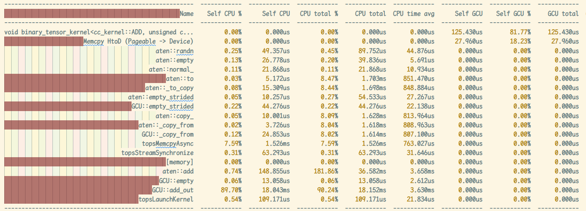
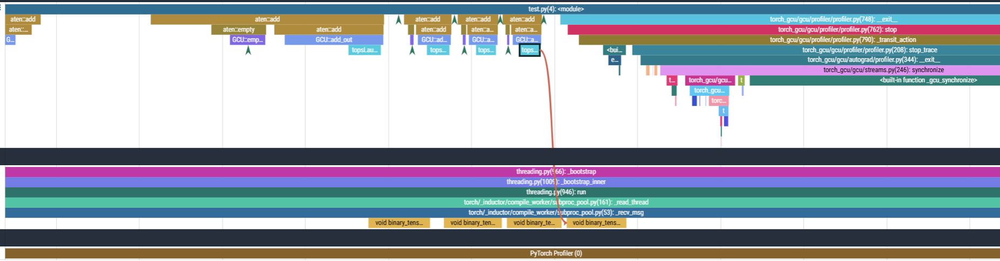

.. _profiler:

###################################
profiler 使用说明
###################################

在 GCU 平台上，torch_gcu 通过 ``torch_gcu.gcu.profiler`` 支持 ``torch.profiler`` 功能。当用户导入 ``torch_gcu`` 后，``torch.profiler`` 会自动被替换为 ``torch_gcu.gcu.profiler``。

因此，在 GCU 平台上使用 ``torch.profiler`` 的方式与在 GPU/CUDA 平台上基本一致，仅需将 ``torch.profiler.ProfilerActivity.CUDA`` 替换为 ``torch.profiler.ProfilerActivity.GCU``。

参考官方文档：https://pytorch.org/docs/2.9/profiler.html

.. warning::
    由于硬件限制，启用 torch_gcu profiler 会增加 device kernel 执行之间的间隔。因此，建议在运行 GCU 性能测试相关样例时关闭 torch_gcu/torch profiler，仅将其用于分析 host 端性能及 host-device 调用关系。

==========
示例
==========

.. code-block:: python
    :linenos:
    :emphasize-lines: 4,7

    import torch
    import torch_gcu
    size = (30, 30)
    with torch.profiler.profile(
        activities=[
            torch.profiler.ProfilerActivity.CPU,
            torch.profiler.ProfilerActivity.GCU,
        ],
        record_shapes=True,
        profile_memory=True,
        with_stack=True,
    ) as prof:
        a = torch.randn(size).gcu()
        b = torch.randn(size).gcu()
        for i in range(5):
            c = a + b
    print(prof.key_averages().table(sort_by="self_gcu_time_total", row_limit=40)) # 打印性能统计表格到输出
    prof.export_chrome_trace('profiler_dump.json') # 导出可视化json文件

==================
性能统计表格
==================

==================
性能可视化
==================

导出的json文件可以通过网页可视化工具查看： `https://ui.perfetto.dev/ <https://ui.perfetto.dev/>`_

