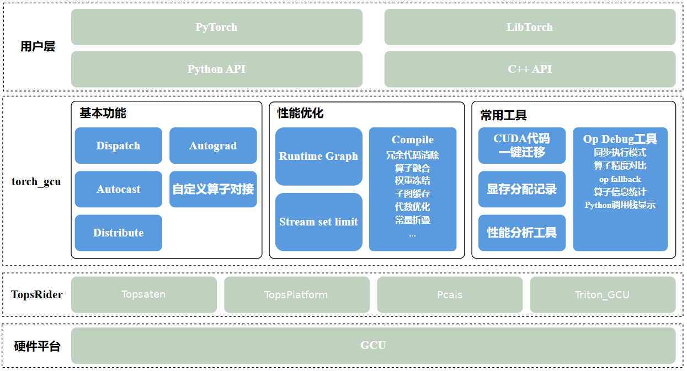

####
概述
####

torch_gcu是支持PyTorch运行在GCU上的backend插件

##########
版本说明
##########

适用软件版本：``v3.7.1``

##############
整体架构图
##############

整体上，用户可通过Python（PyTorch）或C++（LibTorch）前端编写和执行模型，torch_gcu作为后端插件
接管算子分发与执行调度，并将计算任务下沉到TopsAten、编译器与运行时组件，最终在GCU硬件上
完成执行。在分布式训练场景中，框架会结合通信与计算算子进行统一分发调度，提升多卡协同执行效率。
同时提供op debug能力，用于eager模式下算子调度问题的定位与分析（如算子op list dump、参数信息dump及同步执行功能等）。
该架构将上层模型接口与底层设备实现解耦，在保持PyTorch/LibTorch使用习惯的同时提供GCU加速能力。
支持cuda代码一键迁移，用户代码零改动运行在GCU上。

##############
依赖与支持情况
##############

支持PyTorch版本: ``v2.10.0``

支持python版本: ``3.9``, ``3.10``, ``3.12``

Tops相关软件依赖: ``topsruntime``, ``eccl``, ``topsaten``, ``sdk``

############
安装使用说明
############

安装、更新、卸载的详细步骤

====
安装
====

1. 通过installer安装(推荐)

   torch_gcu随TopsRider一起发布，建议使用TopsRider中的installer一键安装。具体方法请参考TopsRider安装文档。

2. 手动安装

   torch_gcu whl包包含在TopsRider发布包中，需要先从TopsRider .run包中解压获取。步骤如下：

   a. 解压TopsRider .run包：

      .. code-block:: shell

         bash ./TopsRider_*.run --extract-only

      解压完成后会在当前目录生成与 .run 文件同名的目录。

   b. 在解压目录中找到torch_gcu whl包，路径为 ``ai_framework/torch_gcu/`` ，根据Python版本选择对应的whl文件：

      .. code-block:: shell

         ls <解压目录>/ai_framework/torch_gcu/torch_gcu*.whl

   c. 通过pip安装：

      .. code-block:: shell

         pip3 install <解压目录>/ai_framework/torch_gcu/torch_gcu-{version}-{python_version}-linux_x86_64.whl

   运行前需要确认已经安装对应版本的官方PyTorch。

=========
更新/重装
=========

更新/重新安装执行以下命令

.. code-block:: shell

    pip3 install --force-reinstall torch_gcu-2.10.0+x.x.x-py3.x-none-any.whl

====
卸载
====

执行命令

.. code-block:: shell

    pip3 uninstall torch_gcu

############
用户使用说明
############

=================
基本使用说明
=================

.. code-block:: python

   import torch
   import torch_gcu
   torch.gcu.is_available()

看到输出 ``True`` 字样表示torch_gcu安装成功，且设备可用。

=================
GPU->GCU迁移说明
=================

-----------------------------
一键自动迁移
-----------------------------

torch_gcu 支持一键自动化迁移 :ref:`transfer_to_gcu`

-----------------------------
手动迁移
-----------------------------

对于GPU可执行的代码需要迁移到GCU上，需要进行以下几方面工作：

1. tensor、nn.module等对象从host端迁移到device端需要将 ``cuda`` 改为 ``gcu``

.. code-block:: python

   a = torch.tensor([1,2,3]).gcu()
   b = torch.tensor([1,2,3]).to("gcu")
   c = torch.tensor([1,2,3], device="gcu")
   model.gcu()
   ...

2. ``torch.cuda.xxx`` 类接口调用需要改为 ``torch.gcu.xxx`` （目前只支持部分接口，后续会完善。已支持接口情况见 :ref:`python_op` ）

.. code-block:: python

   torch.gcu.synchronize()
   torch.gcu.get_device_count()
   ...

3. ``torch.distributed.init_process_group`` 的参数backend由nccl改为eccl，其他torch.distributed.xxx不用改变 （目前只支持部分接口，后续会完善。已支持接口情况见 :ref:`distributed_op` ）

.. code-block:: python

   torch.distributed.init_process_group(
            backend="eccl",
            world_size=world_size,
            rank=rank)
   torch.distributed.all_reduce()
   ...

4. 支持pytorch原生profiler的部分功能，详见： :ref:`profiler`

.. code-block:: python

    import torch
    import torch_gcu

    size = (300, 300, 300)

    with torch.autograd.profiler.profile() as prof:
        a = torch.randn(size).gcu()
        b = torch.randn(size).gcu()
        for i in range(5):
            c = a + b

    print(prof.table()) # 打印性能统计表格到输出
    prof.export_chrome_trace('profiler_dump.json') # 导出可视化json文件

5. ``torch.cuda.amp.xxx`` 类关于amp的接口调用，需要改为 ``torch.gcu.amp.xxx`` 详见： :ref:`amp`

.. code-block:: python

    import torch
    import torch_gcu

    # call autocast
    torch.gcu.amp.autocast()

    # call GradScaler
    torch.gcu.amp.GradScaler()

=================
框架行为控制
=================

通过设置环境变量可以控制部分框架行为。

.. list-table:: 框架行为控制
   :header-rows: 1
   :widths: 40 9 11 40

   * - **环境变量**
     - **类型**
     - **默认值**
     - **说明**
   * - ``PYTORCH_GCU_ALLOC_CONF``
     - ``str``
     - ``""``
     - 设置显存管理参数, ``backend:topsMallocAsync`` 启用 topsruntime 内置的异步分配器; 其余参数设置参考 `pytorch文档 <https://pytorch.org/docs/2.9/cuda_environment_variables.html>`_
   * - ``TORCH_ECCL_ASYNC_ERROR
       _HANDLING``
     - ``int``
     - 3
     - 参考 `pytorch文档 <https://pytorch.org/docs/2.9/torch_nccl_environment_variables.html>`_  中 ``TORCH_NCCL
       _ASYNC_ERROR_HANDLING`` 用法
   * - ``USE_GCU_DEFAULT_STREAM``
     - ``bool``
     - true
     - 控制是否使用GCU默认流
   * - ``TORCH_GCU_ENABLE_INT64_AND
       _UINT64``
     - ``bool``
     - false
     - 控制是否启用int64和uint64数据类型的支持
   * - ``PYTORCH_NO_GCU_MEMORY_CACHING``
     - ``bool``
     - false
     - 参考 `pytorch文档 <https://pytorch.org/docs/2.9/cuda_environment_variables.html>`_  中 ``PYTORCH_NO
       _CUDA_MEMORY_CACHING`` 用法
   * - ``TORCH_GCU_ALLOC_LOG_TO_FILE``
     - ``bool``
     - false
     - 将内存分配日志写入文件
   * - ``TORCH_GCU_ECCL_SIP_NUM``
     - ``int``
     - 12
     - 配置ECCL的SIP(Stream Interface Processor)数量
   * - ``TORCH_ECCL_BLOCKING_WAIT``
     - ``bool``
     - false
     - 参考 `pytorch文档 <https://pytorch.org/docs/2.9/torch_nccl_environment_variables.html>`_
       中 ``TORCH_NCCL_BLOCKING_WAIT`` 用法
   * - ``TORCH_ECCL_ENABLE_MONITORING``
     - ``bool``
     - true
     - 参考 `pytorch文档 <https://pytorch.org/docs/2.9/torch_nccl_environment_variables.html>`_  中 ``TORCH_NCCL_ENABLE_MONITORING`` 用法
   * - ``TORCH_ECCL_HEARTBEAT_TIMEOUT
       _SEC``
     - ``int``
     - 600
     - 参考 `pytorch文档 <https://pytorch.org/docs/2.9/torch_nccl_environment_variables.html>`_  中 ``TORCH_NCCL
       _HEARTBEAT_TIMEOUT_SEC`` 用法
   * - ``TORCH_ECCL_COORD_CHECK_MILSEC``
     - ``int``
     - 1000
     - 参考 `pytorch文档 <https://pytorch.org/docs/2.9/torch_nccl_environment_variables.html>`_  中 ``TORCH_NCCL_COORD_CHECK_MILSEC`` 用法
   * - ``TORCH_ECCL_USE_TENSOR
       _REGISTER_ALLOCATOR_HOOK``
     - ``bool``
     - false
     - 用法同NCCL，启用tensor注册分配器钩子,当tensor分配或释放时,ProcessGroupECCL可以在所有可用的ECCL通信器上注册/注销tensor
   * - ``ENFLAME_PT_OP_DEBUG_CONFIG``
     - ``str``
     - ``""``
     - 配置算子调试选项,支持多个调试功能的组合配置,详细说明见 :ref:`op_debug` 。
   * - ``ENFLAME_PT_ENABLE_LINEAR
       _OVERRIDE``
     - ``str``
     - ``"false"``
     - 是否重载linear的gcu实现，否则走原生拆解逻辑实现
   * - ``ENFLAME_PT_GELU_ERF_ENABLE``
     - ``str``
     - ``"false"``
     - 控制GELU算子是否使用ERF(Error Function)实现
   * - ``ENFLAME_TORCH_GCU_ENABLE_AUTO
       _MIGRATION``
     - ``str``
     - 未设置
     - 是否启用migration做其他框架适配，做代码monkey patching的gcu功能迁移。不设置或设置为 ``false`` 时禁用，设置为 ``true`` 时启用
   * - ``TORCH_ECCL_DESYNC_DEBUG``
     - ``bool``
     - false
     - 参考 `pytorch文档 <https://pytorch.org/docs/2.9/torch_nccl_environment_variables.html>`_  中 ``TORCH_NCCL_DESYNC_DEBUG`` 用法
   * - ``TORCH_ECCL_DUMP_ON_TIMEOUT``
     - ``bool``
     - false
     - 参考 `pytorch文档 <https://docs.pytorch.org/docs/2.9/torch_nccl_environment_variables.html>`_  中 ``TORCH_NCCL_DUMP_ON_TIMEOUT`` 用法
   * - ``TORCH_ECCL_ENABLE_TIMING``
     - ``bool``
     - false
     - 参考 `pytorch文档 <https://pytorch.org/docs/2.9/torch_nccl_environment_variables.html>`_  中 ``TORCH_NCCL_ENABLE_TIMING`` 用法
   * - ``TORCH_ECCL_TRACE_BUFFER_SIZE``
     - ``int``
     - 60000
     - 参考 `pytorch文档 <https://pytorch.org/docs/2.9/torch_nccl_environment_variables.html>`_  中 ``TORCH_NCCL_TRACE_BUFFER_SIZE`` 用法
   * - ``TORCH_ECCL_DEBUG_INFO_PIPE
       _FILE``
     - ``str``
     - 未设置
     - 参考 `pytorch文档 <https://docs.pytorch.org/docs/2.9/torch_nccl_environment_variables.html>`_  中 ``TORCH_NCCL
       _DEBUG_INFO_PIPE_FILE`` 用法

..
=================
调试信息输出
=================

调试信息输出通过环境变量控制。

1. ``export ENFLAME_LOG_DEBUG_LEVEL="DEBUG"``

   string类型，设置为 ``DEBUG`` 开启调试信息输出。这是所有调试信息的总开关。

2. ``export ENFLAME_LOG_DEBUG_MOD="TORCH_GCU"``

   string类型, 可以设置为模块名 ``TORCH_GCU`` 以输出模块所有信息，内容较多; 或者使用子模块名 ``TORCH_GCU/XXX`` 只输出指定信息。建议使用后者。

   可以同时指定多个子模块，形式为 ``TORCH_GCU/XXX1,TORCH_GCU/XXX2`` 。

   目前支持的子模块：

   ``OP`` ：输出所有op调用信息。

   ``FALLBACK`` ：输出所有被fallback的op信息。GCU上未实现的算子torch_gcu会自动尝试将其fallback到torch cpu算子执行，以保证功能正确，但会对性能造成负面影响。

   ``MEMORY`` ：输出所有torch_gcu中显存分配与释放信息。

=================
Op Debug模块
=================
torch_gcu提供Op Debug模块用于调试eager模式下op执行问题，详细说明见 :ref:`op_debug` 。

=================
已知问题
=================
1. 底层软硬件无法支持64位类型，如I64，F64等，torch_gcu会做隐式转换，转为使用32位数据类型。可能会导致精度问题或数值溢出问题。在使用时会输出warning提示信息。
2. 由于1，当tensor为64位类型时，使用tensor.data_ptr接口获取的地址可能有误

